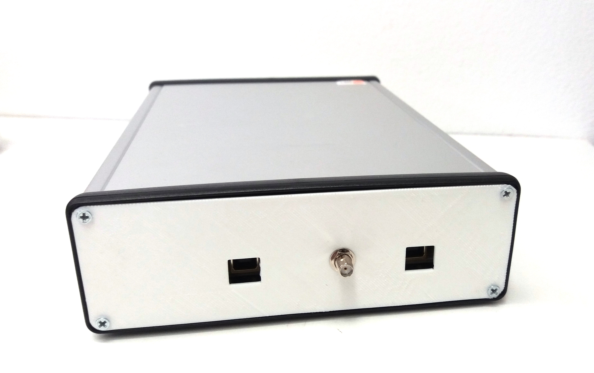

## VLF monitoring station

Monitoring station optimized for (Sudden ionospheric disturbances) SID monitoring and detection by monitoring of VLF signals from submarine transmitters.

## Hardware

### Antenna

## Additional possible uses

  * Lightning detection
